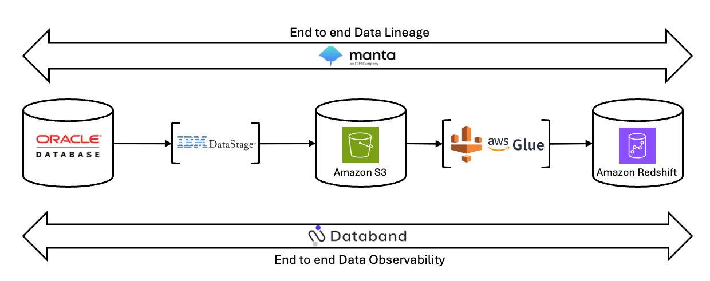

# End to end Data Observability and Data Lineage

This section covers step by step guidance for PoX of Databand and Manta.

We have defined PoX as having 3 data stores: OLTP system, Staging, Data Warehouse. 

DataStage will be used for ETL from OLTP to Staging and Glue Job Spark will be used to ingesting data from Staging to Data Warehouse. Redshift Store Procedure will be used for further transform in Warehouse.

<kbd><kbd>

## Environments:
- Ubuntu 22.04
	- Host the OpenLineage / Marquez and Oracle Container Database
- Oracle Container 19c
	- Serve as data source for traditional RDBMS.
- DataStage NextGen
	- Use for exporting data from Oracle RDBMS to csv file in Amazon S3
- Amazon S3
	- Contain Staging data in CSV format.
- Glue Spark
	- Use for ingesting data in csv file from Amazon S3 to Amazon Redshift
- RedShift Serverless
	- Use for DataWarehouse data store with store procedure.

## Table of Contents

### Main
- Environment Setup
    - [Environment Setup](env-setup/env-setup.md)
- Oracle Database Setup
    - [Oracle Database Setup](oracle-database/oracle-db.md)
- OpenLineage
    - [OpenLineage](OpenLineage/openlineage.md)
- Glue Job
    - [Glue Job](glue-job/glue-job.md)

### Optional
- Local Spark
    - [Local Spark](local-spark/local-spark.md)
	
### [[Next]](env-setup/env-setup.md) $${\color{green}Environment \space Setup}$$

